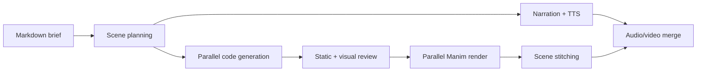

# Manim Video Agent

[](https://github.com/evlo-malik/manim-video-agent/actions/workflows/ci.yml)
[](LICENSE)
[](pyproject.toml)

An agentic pipeline that turns a Markdown brief into a narrated Manim video. It plans independent scenes, generates animation code, runs static and visual review loops, renders scenes in parallel, synthesizes narration, and assembles the final video.

The project exposes each stage as a Python module. You can run the complete pipeline or reuse the planner, validator, timing parser, renderer, and stitcher separately.

> [!IMPORTANT]
> This is an alpha developer tool. Generated Python executes locally during rendering. Run it in an isolated container when processing untrusted prompts or operating a shared service.

## Pipeline



Scene isolation is the central design choice. A failed scene can be regenerated or rendered without restarting the entire video, and parallel workers reduce end-to-end latency.

## Requirements

- Python 3.11–3.13
- [Manim Community Edition system dependencies](https://docs.manim.community/en/stable/installation.html)
- FFmpeg
- an OpenRouter API key
- an Inworld API key for narration audio

## Install

```bash
git clone https://github.com/evlo-malik/manim-video-agent.git
cd manim-video-agent
python -m venv .venv
source .venv/bin/activate
pip install -e '.[dev]'
cp .env.example .env
```

Add your provider keys to `.env`.

## Generate a video

Write a focused brief:

```markdown
# Fourier series

Explain how a periodic signal can be reconstructed from sine waves. Build from one wave to a square-wave approximation, label the first three harmonics, and end with the frequency-domain intuition.
```

Then run:

```bash
manim-video-agent brief.md --job fourier-series --output output
```

Artifacts are kept by stage under `output/fourier-series/`: scene plans, generated code, review frames, rendered clips, narration, and the final video.

## Use individual components

Static validation does not require a render:

```python
from manim_video_agent.core.validator import validate_source

issues = validate_source(generated_code)
for issue in issues:
    print(issue)
```

Timing extraction estimates narration windows from `play`, `wait`, and scene-clear calls:

```python
from manim_video_agent.core.timing_parser import parse_single_scene_timing

timing = parse_single_scene_timing(code, scene_id="intuition")
```

## Architecture

- `core/composer.py` researches a topic and produces a structured scene plan.
- `core/scene_generator.py` generates one self-contained Manim scene.
- `core/validator.py` catches common layout and API errors through AST analysis.
- `core/visual_reviewer.py` renders frames and asks a vision model to review them.
- `core/narration.py` writes narration, synthesizes speech, and aligns duration.
- `core/parallel_pipeline.py` coordinates retries, parallelism, and final assembly.
- `data/skills/` contains prompt-time Manim and composition guidance.

## Safety boundary

The pipeline renders model-produced Python. For production use:

- run each job in an ephemeral container without host credentials;
- apply CPU, memory, process, file, and wall-clock limits;
- restrict outbound network access during rendering;
- inspect generated code and retain an audit trail;
- keep provider keys outside the render environment.

The built-in validator improves reliability; it is not a security sandbox.

## Development

```bash
ruff check .
ruff format --check .
pytest --cov=manim_video_agent
python -m build
```

See [CONTRIBUTING.md](CONTRIBUTING.md) for the change policy and [THIRD_PARTY_NOTICES.md](THIRD_PARTY_NOTICES.md) for bundled guidance attribution.

## License

[MIT](LICENSE)
